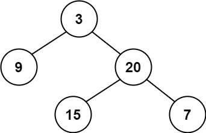
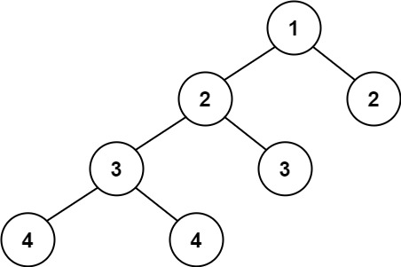

# 110. Balanced Binary Tree

Given a binary tree, determine if it is **height-balanced**.

**height-balanced:** A **height-balanced** binary tree is a binary tree in which the depth of the two subtrees of every node never differs by more than one.

## Example 1:



```
Input: root = [3,9,20,null,null,15,7]
Output: true
```

## Example 2:



```
Input: root = [1,2,2,3,3,null,null,4,4]
Output: false
```

## Example 3:

```
Input: root = []
Output: true
```

## Constraints:

- The number of nodes in the tree is in the range `[0, 5000]`.
- `-10⁴ <= Node.val <= 10⁴`
