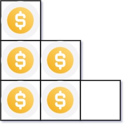
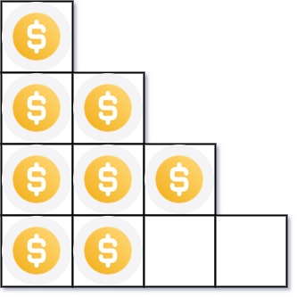

# 441.Arranging Coins

You have `n` coins and you want to build a staircase with these coins. The staircase consists of `k` rows where the `iᵗʰ` row has exactly `i` coins. The last row of the staircase **may be** incomplete.

Given the integer `n`, return _the number of **complete rows** of the staircase you will build_.

## Example 1:



```
Input: n = 5
Output: 2
Explanation: Because the 3rd row is incomplete, we return 2.
```

## Example 2:



```
Input: n = 8
Output: 3
Explanation: Because the 4th row is incomplete, we return 3.
```

## Constraints:

- `1 <= n <= 2³¹ - 1`
