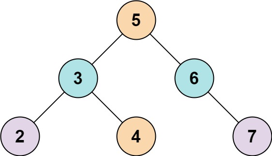
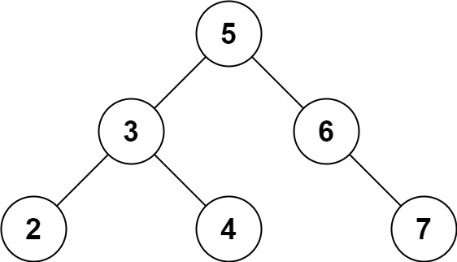

# 653. Two Sum IV - Input is a BST

Given the `root` of a binary search tree and an integer `k`, return `true` _if there exist two elements in the BST such that their sum is equal to_ `k`_, or_ `false` _otherwise_.

## Example 1:



```
Input: root = [5,3,6,2,4,null,7], k = 9
Output: true
```

## Example 2:



```
Input: root = [5,3,6,2,4,null,7], k = 28
Output: false
```

## Constraints:

- The number of nodes in the tree is in the range `[1, 10⁴]`.
- `-10⁴ <= Node.val <= 10⁴`
- `root` is guaranteed to be a **valid** binary search tree.
- `-10⁵ <= k <= 10⁵`
